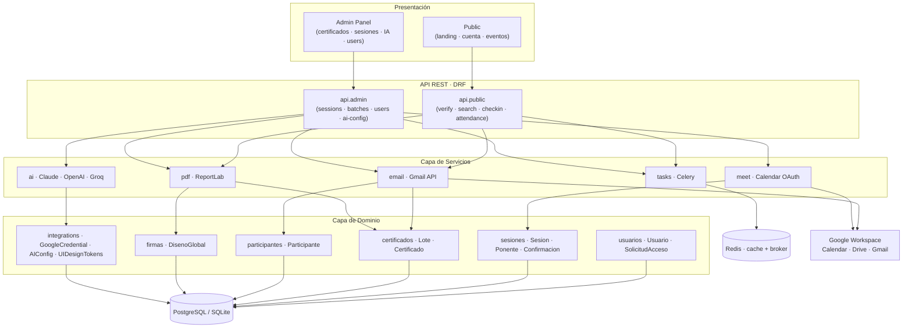

# CertifAI

> Plataforma de certificación digital con IA · Universidad Estatal de Milagro

CertifAI gestiona el ciclo completo de eventos académicos: registro de
participantes, asistencia con QR, generación masiva de diplomas, verificación
pública con código único, y resúmenes automáticos de las reuniones con IA.

---

## Tabla de contenidos

- [Stack](#stack)
- [Arquitectura](#arquitectura)
- [Flujos principales](#flujos-principales)
- [Setup local](#setup-local)
- [Setup con Docker](#setup-con-docker)
- [Tests](#tests)
- [Tareas asíncronas (Celery)](#tareas-asíncronas-celery)
- [API · Documentación](#api--documentación)
- [Decisiones de arquitectura (ADRs)](#decisiones-de-arquitectura-adrs)
- [Estructura del repositorio](#estructura-del-repositorio)

---

## Stack

| Capa | Tecnología |
|---|---|
| **Backend** | Django 5.2 + Django REST Framework |
| **Frontend** | Server-side rendering (Django Templates) + Tailwind CDN + JS vanilla |
| **DB** | SQLite (dev) · PostgreSQL (producción) |
| **Cache + colas** | Redis · Celery |
| **Auth** | Sesión Django (admin) · JWT (`simplejwt`) · Sesión propia (participantes) |
| **PDFs** | ReportLab |
| **IA** | Anthropic Claude / OpenAI / Groq (proveedor seleccionable) |
| **Integraciones** | Google Workspace (Calendar · Drive · Gmail) vía OAuth 2.0 |
| **Tests** | pytest + pytest-django + factory-boy |
| **API docs** | drf-spectacular (OpenAPI 3 + Swagger UI + ReDoc) |
| **Deploy** | Docker · Railway · gunicorn + whitenoise |

---

## Arquitectura

**Patrón**: Monolito modular en capas con interfaz REST (Layered Modular Monolith).



**Apps como bounded contexts (DDD ligero)**:

| App | Responsabilidad |
|---|---|
| `core` | Modelos de dominio + servicios + lógica compartida |
| `api/admin` | Endpoints REST autenticados (CRUD + reportes) |
| `api/public` | Endpoints REST públicos (verificar · registrarse · buscar) |
| `admin_panel` | UI del panel administrativo (templates + vistas) |
| `public` | UI pública (landing · cuenta participante · registro a eventos) |
| `config` | Settings · URLs raíz · Celery app · WSGI |

---

## Flujos principales

### 1 · Inscripción a evento → certificado

```
Estudiante navega a /cuenta/eventos/
  ↓
Click "Inscribirme"
  ↓
public.views.evento_inscribir
  ├─ Crea ConfirmacionAsistencia
  └─ celery: send_event_inscription_async  →  Gmail API  →  inbox del user
```

### 2 · Generación masiva de diplomas

```
Admin click "Generar lote" en /panel/sessions/<id>/generate-batch/
  ↓
POST /api/v1/admin/sessions/<id>/generate-batch/
  ↓
api.admin.sessions.generate_batch
  ├─ Crea LoteCertificados con firmas + logos default
  ├─ Crea N×Certificado (bulk_create)
  ├─ Asocia sesion.lote = lote
  └─ celery: send_certificate_issued_bulk(lote_id)
                ↓
        worker procesa en background
                ↓
        Gmail API envía a todos los inscritos
```

### 3 · Verificación pública

```
Cualquier persona ingresa a /verificar/<hash>/
  ↓
GET /api/v1/public/verify/<hash>/
  ↓
api.public.verify
  ├─ Lookup por hash_verificacion
  ├─ Incrementa veces_buscado (analítica)
  └─ Devuelve datos públicos del cert + lote
```

---

## Setup local

```bash
# 1. Clonar y crear venv
git clone <repo>
cd CertifAI
python -m venv .venv
source .venv/bin/activate  # o .venv\Scripts\activate en Windows

# 2. Instalar dependencias
pip install -r requirements.txt

# 3. Configurar entorno
cp .env.example .env
# Editar .env con tus credenciales (Google OAuth, secret key, etc.)

# 4. Migrar DB
python manage.py migrate
python manage.py createsuperuser

# 5. Correr el servidor
python manage.py runserver 0.0.0.0:8500
```

Visita [http://localhost:8500](http://localhost:8500).

---

## Setup con Docker

```bash
# Levanta web + db (postgres) + redis + celery worker + beat
docker compose up -d

# Migrar DB
docker compose exec web python manage.py migrate

# Crear superuser
docker compose exec web python manage.py createsuperuser

# Logs en vivo
docker compose logs -f web worker

# Apagar
docker compose down
```

Servicios:

| Servicio | Puerto | Descripción |
|---|---|---|
| `web` | 8000 | Django + gunicorn |
| `db` | 5432 | PostgreSQL 16 |
| `redis` | 6379 | Cache + Celery broker |
| `worker` | — | Celery worker (1+ procesos) |
| `beat` | — | Celery beat scheduler (cron jobs) |

---

## Tests

```bash
# Todos
pytest

# Sólo tests críticos del dominio
pytest tests/test_critical_flows.py -v

# Con coverage
pytest --cov=core --cov=api --cov=public --cov=admin_panel

# Test específico
pytest tests/test_critical_flows.py::test_verify_certificate_happy_path
```

13 tests críticos cubren los 4 flujos no-rompibles:
verificación pública por hash · inscripción a evento · generación de lote · auth pública.

---

## Tareas asíncronas (Celery)

```bash
# Worker (en otra terminal, con redis corriendo)
celery -A config worker -l info

# Beat scheduler (jobs cron)
celery -A config beat -l info

# En desarrollo sin Redis: setear CELERY_TASK_ALWAYS_EAGER=True en .env
# las tareas correrán sincrónicas en el mismo request.
```

Tasks definidas en [`core/tasks/email_tasks.py`](core/tasks/email_tasks.py):

- `send_certificate_issued_bulk(lote_id)` — envía notificación de cert emitido a todos los participantes del lote
- `send_welcome_email_async(participante_id)`
- `send_event_inscription_async(participante_id, sesion_id)`

Todas con `autoretry_for=(Exception,)` y backoff exponencial (max 3 retries).

---

## API · Documentación

Una vez corriendo el server:

| URL | Descripción |
|---|---|
| `/api/docs/` | **Swagger UI** interactivo |
| `/api/redoc/` | ReDoc (read-only, más estético) |
| `/api/schema/` | OpenAPI 3 schema (JSON) |

---

## Decisiones de arquitectura (ADRs)

Las decisiones grandes están documentadas en [`docs/adr/`](docs/adr/):

1. [ADR-001 · Monolito modular vs microservicios](docs/adr/0001-monolito-modular-vs-microservicios.md)
2. [ADR-002 · DRF vs FastAPI](docs/adr/0002-drf-vs-fastapi.md)
3. [ADR-003 · Auth dual (Sesión Django + JWT + Participante)](docs/adr/0003-auth-dual.md)
4. [ADR-004 · Singleton config (Design System · AI · Google)](docs/adr/0004-singleton-config.md)
5. [ADR-005 · Tailwind CDN vs bundler](docs/adr/0005-tailwind-cdn-vs-bundler.md)

---

## Estructura del repositorio

```
CertifAI/
├── config/             → settings · urls · celery app
├── core/
│   ├── models/         → bounded contexts (usuarios · sesiones · certs · etc.)
│   ├── services/       → email · meet · ai · pdf · excel
│   ├── tasks/          → tareas Celery
│   ├── managers/       → custom QuerySets
│   └── base/           → SingletonModel · TimestampedModel · mixins
├── api/
│   ├── admin/          → endpoints REST autenticados
│   └── public/         → endpoints REST públicos
├── admin_panel/        → UI del panel administrativo (templates + vistas)
├── public/             → UI pública (landing · cuenta · etc.)
├── static/
│   ├── js/
│   │   ├── components/ → JS reutilizable (theme · carousel · countdown · etc.)
│   │   └── pages/      → Entry-points por pantalla
│   └── img/
├── templates/
│   ├── components/     → loader · background_decor compartidos
│   └── emails/         → plantillas HTML transaccionales
├── tests/              → pytest + factories
└── docs/
    ├── adr/            → Architecture Decision Records
    └── ARCHITECTURE.md → vista global
```

---

## Licencia

Proyecto académico · Universidad Estatal de Milagro · 2026
