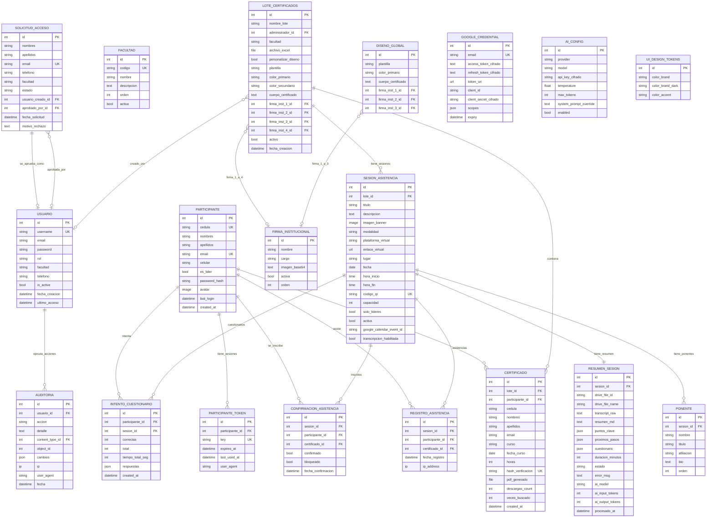

# Modelo de Base de Datos · CertifAI

Diagrama entidad-relación (ERD) generado a partir del esquema actual.

> Para renderizarlo:
> - **GitHub**: se renderiza automáticamente al abrir este archivo en el repo
> - **VSCode**: instalar extensión _Markdown Preview Mermaid Support_ y abrir preview
> - **Online**: copiar el bloque mermaid a https://mermaid.live
> - **PNG**: en mermaid.live → Actions → Export PNG/SVG

---

## ERD por dominios



---

## Leyenda

| Notación | Significado |
|---|---|
| `PK` | Primary Key |
| `UK` | Unique Key (constraint UNIQUE) |
| `FK` | Foreign Key |
| `_cifrado` | Campo cifrado at-rest con Fernet (AES-128 + HMAC) |

### Cardinalidades Mermaid

| Notación | Significado |
|---|---|
| `||--o{` | Uno a muchos (1:N) |
| `||--||` | Uno a uno obligatorio (1:1) |
| `||--o|` | Uno a uno opcional |
| `}o--o|` | Muchos a uno opcional |

---

## Resumen estadístico

| Métrica | Valor |
|---|---|
| Tablas totales | **20** |
| Catálogos lookup | 1 (`Facultad`) |
| Singletons | 3 (`DisenoGlobal`, `AIConfig`, `UIDesignTokens`) |
| Relaciones 1:1 | 2 (`Sesion ↔ Resumen`, `Solicitud ↔ Usuario`) |
| Relaciones 1:N principales | 12 |
| Campos cifrados (Fernet) | 4 (api_key + 3 tokens Google) |
| Índices declarados | ~25 |

---

## Dominios funcionales

```
ADMINISTRACIÓN          CATÁLOGOS
 - Usuario               - Facultad
 - SolicitudAcceso       - (TextChoices)
       |
       v
 PARTICIPANTES
  - Participante
  - ParticipanteToken
       |
       +----------------+----------------+
       v                v                v
 CERTIFICADOS      SESIONES        PIPELINE IA
  - Lote            - Sesion         - ResumenSesion
  - Certificado     - Ponente        - IntentoCuestionario
  - FirmaInst       - Confirmacion         |
  - DisenoGlobal    - Registro             v
                                     INTEGRACIONES (cifradas)
                                      - GoogleCredential
                                      - AIConfig

 AUDITORIA (transversal con ContentType + diff JSON)
```

---

## Flujos principales

### 1. Certificación
```
Admin -> crea LoteCertificados -> carga Excel
        |
        v
    genera N Certificados (uno por Participante)
        |
        v
    Participante consulta via /verify/<hash>/  =>  descargas_count++
```

### 2. Evento + asistencia
```
Admin -> crea SesionAsistencia (con Ponentes)
        |
        v
    Participante escanea QR -> RegistroAsistencia
        |
        v
    Si transcripcion_habilitada:
        Celery Beat (cada 30 min) -> busca transcript Drive
            -> genera ResumenSesion (estado=listo)
        |
        v
    Participante hace Cuestionario -> IntentoCuestionario (max 2)
```

### 3. Pipeline IA
```
SesionAsistencia
   --> ResumenSesion (1:1)
         - resumen_md (Markdown)
         - puntos_clave (JSON list)
         - proximos_pasos (JSON list)
         - cuestionario (JSON con preguntas + opciones + correcta_idx)
              --> IntentoCuestionario (N por Participante)
```

---

## Pendientes de refactor

| # | Mejora | Impacto |
|---|---|---|
| 1 | Firmas 1..4 en `LoteCertificados` / `DisenoGlobal` -> tabla pivote `LoteFirma` | Normalización 1NF |
| 2 | `FirmaInstitucional.imagen` base64 (TextField) -> `ImageField` con archivo en media | Performance + storage |
| 3 | `RegistroAsistencia.certificado` / `participante` nullable redundante (legacy) | Limpieza |
